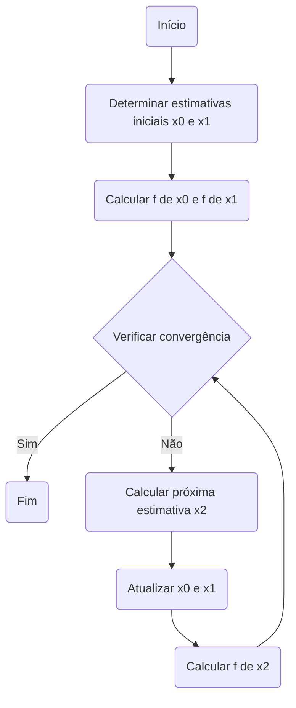

O método da secante começa com duas estimativas iniciais para a raiz, \( x_0 \) e \( x_1 \). A próxima estimativa da raiz, \( x_2 \), é calculada utilizando a fórmula:

  

    $x_2 = x_1 - \frac{f(x_1) \cdot (x_1 - x_0)}{f(x_1) - f(x_0)}$
  

Este processo é repetido até que a convergência seja alcançada, ou seja, até que a diferença entre duas estimativas consecutivas seja menor que uma tolerância especificada ou o número máximo de iterações seja atingido.

## Como Usar

A função `secant_solver` neste repositório pode ser usada para encontrar raízes de funções utilizando o método da secante.

